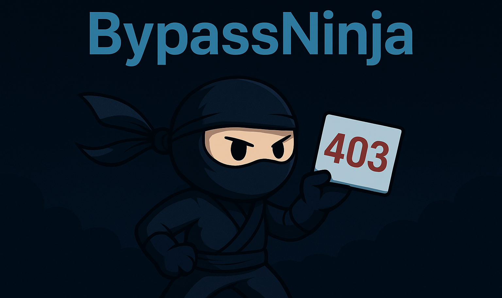
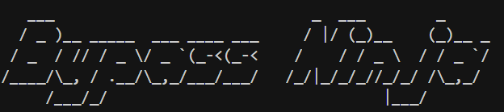
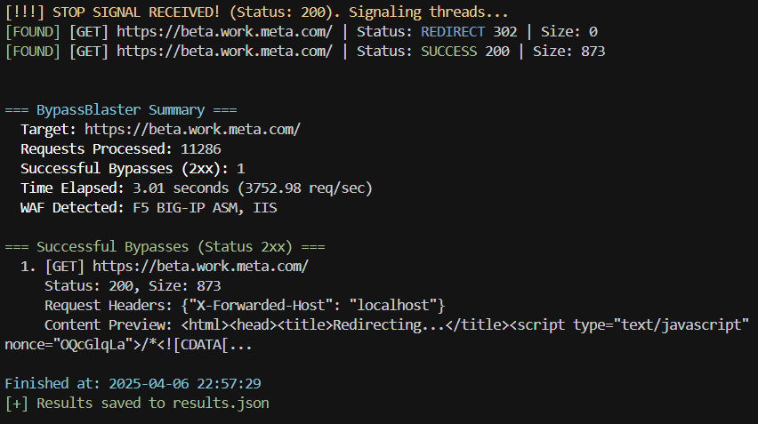

## **BypassNinja** is a tool designed to evade HTTP (403) blocks by utilizing various methods and headers. Below is how to use the tool.

## Requirements

- Python 3.x
- Required libraries can be installed using `pip`:

```bash
pip install -r requirements.txt
```

## Usage

To run the tool, use the following command in the terminal:

```bash
python bypassninja.py <URL> [options]
```




### Parameters

- `<URL>`: The target URL (e.g., `https://example.com`).
- `-p`, `--path`: Specify the path to test (default: `/`).
- `-o`, `--output`: Output file for results in JSON format.
- `--proxy`: Proxy URL (e.g., `http://127.0.0.1:8080`).
- `-t`, `--threads`: Number of concurrent threads (default: `20`).
- `--timeout`: Request timeout in seconds (default: `10.0`).
- `-d`, `--delay`: Delay between requests per thread in seconds (default: `0`).
- `-v`, `--verbose`: Verbose output (show all non-successful attempts).
- `-r`, `--retry`: Number of retries for failed requests (default: `1`).
- `-c`, `--cookie`: Cookies string (e.g., `'name1=value1; name2=value2'`).
- `--follow-redirects`: Follow redirects (may impact bypass detection).
- `--headers`: Custom headers as a JSON string (e.g., `'{"Header": "Value"}'`).
- `--payloads`: File containing custom path mutation payloads (one per line).
- `--max-requests`: Maximum number of requests to make (randomly selected).
- `--burst`: Burst mode (uses only GET/POST methods).
- `--no-verify`: Disable SSL verification.
- `--stop-on-success`: Stop after the first success (2xx) or redirect (3xx).

### Example Command

```bash
python bypassninja.py https://target.com -p /admin --output results.json --threads 10 --stop-on-success
```

This command will attempt to evade blocks on `https://example.com` at the path `/admin`, using 10 threads and saving the results to `results.json`. The tool will stop after finding the first success or redirect.


### Recommended command

```bash
python3 bypassninja.py https://target.com --timeout 3 -d 1 -o report --stop-on-success
```





## New Features: WAF Bypass Techniques (4/10/2025)

### IP Address Representation Variations 
Based on an article written by Zakhar Fedotkin  [PortSwigger's URL Validation Bypass research](https://portswigger.net/research/introducing-the-url-validation-bypass-cheat-sheet), BypassNinja now implements various IP address representation techniques to bypass WAF restrictions:

- **Octal Format**: Converting IP segments to octal (e.g., `127.0.0.1` → `0177.0000.0000.0001`)
- **Hexadecimal Format**: Converting to hex notation (e.g., `127.0.0.1` → `0x7F.0x00.0x00.0x01`)
- **Binary Format**: Full binary representation of IP segments
- **Partial Decimal**: Combined decimal notation
- **DWORD Notation**: 32-bit integer representation
- **IPv6 Mapped**: IPv4 mapped to IPv6 format (e.g., `::FFFF:127.0.0.1`)

## Notes

- Ensure you have permission to perform testing on the target.
- Use the tool responsibly and ethically.


## Author

- **@M4rt1n_0x1337** - *Initial work* - [X](https://x.com/M4rt1n_0x1337)

